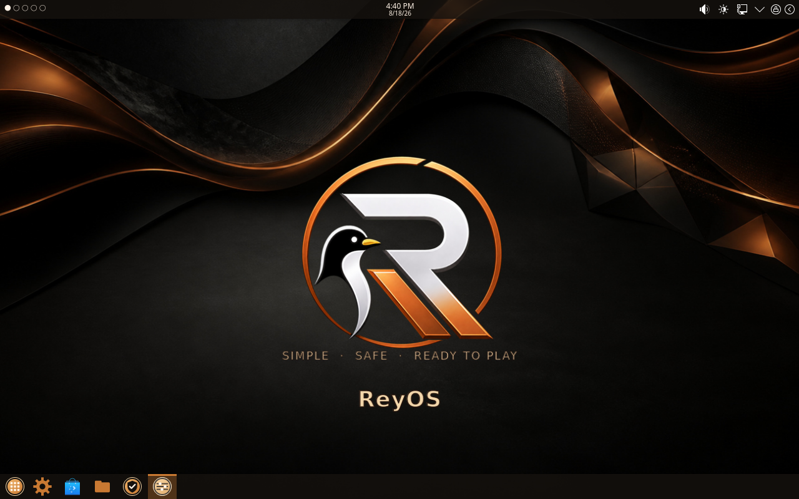
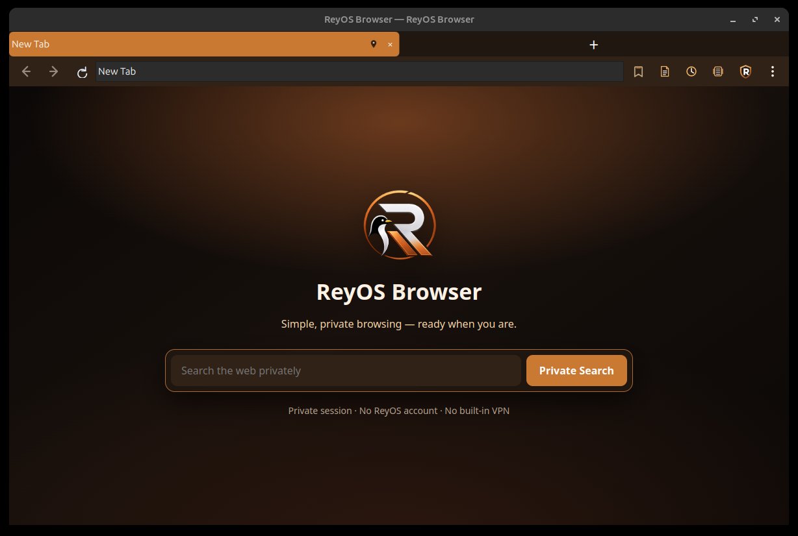

# ReyOS

**SIMPLE · SAFE · READY TO PLAY**

ReyOS is a calm, dependable KDE Plasma Linux distribution built on Arch: easy enough that a new user can install, use, and update it without becoming a Linux administrator, powerful enough that an experienced user is never boxed in.

## Screenshots

| Desktop | ReyOS Browser |
|---|---|
|  |  |

## Features

- **KDE Plasma 6 / Wayland**, tuned for a clean, low-clutter default desktop.
- **ReyOS Browser** — a native PySide6/Qt WebEngine (Chromium) browser, not a wrapper around another browser. Private in-memory profile, tab freeze/discard Low Memory Mode, Reader Mode, Find in Page, session history, download manager, and ReyOS Shields ad/tracker blocking.
- **Control Center** — one place for firewall, drivers, backups, and system settings instead of scattered system tools.
- **ReyOS Welcome** — a first-login setup flow for picking optional software instead of hunting through a package manager.
- **Calamares installer** with ReyOS branding, ext4 by default, and a tested end-to-end install path.
- No telemetry by default.

See [docs/vision-roadmap.md](docs/vision-roadmap.md) for the full product direction and [docs/browser.md](docs/browser.md) for ReyOS Browser's current feature set.

## Status

ReyOS is in active development. Core install → boot → login → desktop flow is verified on real hardware and VMs; see [docs/bugs.md](docs/bugs.md) and [docs/fixes.md](docs/fixes.md) for the current known-issues and fix log. ISO downloads are not yet published — check [reyos.reyapps.com](https://reyos.reyapps.com) for the current status.

## Repository layout

```
reyos-packages/   PKGBUILDs for every reyos-* package (source of truth for each component)
reyos-iso/        archiso profile used to build the installable ISO
docs/             developer guide, roadmap, bug/fix logs
flatpak/          Flatpak packaging for ReyOS Browser
```

See [docs/DEVELOPER.md](docs/DEVELOPER.md) for the full build workflow.

## Links

- Website: [reyos.reyapps.com](https://reyos.reyapps.com)
