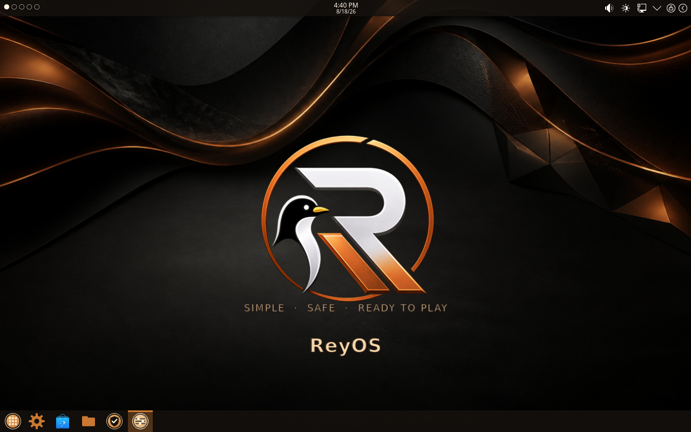
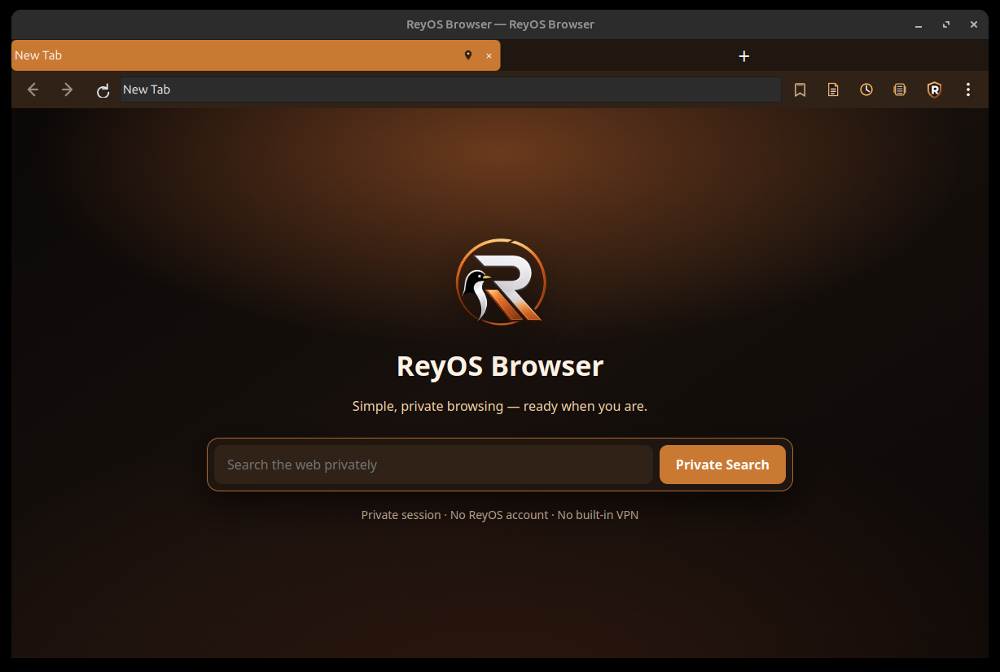

# ReyOS

**SIMPLE · SAFE · READY TO PLAY**

ReyOS is a calm, dependable KDE Plasma Linux distribution built on Arch: easy enough that a new user can install, use, and update it without becoming a Linux administrator, powerful enough that an experienced user is never boxed in.

## Screenshots

| Desktop | Reyva (browser) |
|---|---|
|  |  |

## Features

- **KDE Plasma 6 / Wayland**, tuned for a clean, low-clutter default desktop.
- **Reyva** (the ReyOS browser) — a native PySide6/Qt WebEngine (Chromium) browser, not a wrapper around another browser. Private in-memory profile, tab freeze/discard Low Memory Mode, Reader Mode, Find in Page, session history, download manager, and ReyOS Shields ad/tracker blocking.
- **Control Center** — one place for updates, firewall, drivers, backups, Looks (whole-desktop styles), and system settings instead of scattered system tools. Anything that changes the system asks for your password.
- **Stable updates** — Arch packages come from a tested snapshot (the stable channel), moved forward weekly after an automated check that ReyOS's apps still start on it, so a half-finished Arch update can't break the desktop.
- **ReyOS Reader** — a native EPUB, PDF and comic (CBZ/CBR) reader with search and PDF annotations.
- **Gaming** — Steam, GameMode and the MangoHud overlay in one click; emulators from NES to PlayStation 2 and 3DS installed per system, with a game library, controller setup and a BIOS checker/importer for your own BIOS dumps. Games started from ReyOS run with GameMode and an optional FPS overlay, and one button adds the same to Steam games. No games or BIOS files are included.
- **ReyOS Welcome** — a first-login setup flow for picking optional software instead of hunting through a package manager.
- **Calamares installer** with ReyOS branding, ext4 by default, and a tested end-to-end install path.
- No telemetry by default.

See [docs/vision-roadmap.md](docs/vision-roadmap.md) for the full product direction and [docs/browser.md](docs/browser.md) for Reyva's current feature set.

## Status

ReyOS is in active development. Core install → boot → login → desktop flow is verified on real hardware and VMs; see [docs/bugs.md](docs/bugs.md) and [docs/fixes.md](docs/fixes.md) for the current known-issues and fix log. The latest ISO is [2026.10.08](https://github.com/Reypaulino/ReyOS/releases/tag/reyos-2026.10.08) (fixes the 2026.10.01 installer stopping at the graphics-driver step); after installing, run Control Center → Updates → **Install updates** and restart: that brings in the latest bug and security fixes and takes care of most known issues. See [reyos.reyapps.com](https://reyos.reyapps.com) for downloads and the current state.

## Repository layout

```
reyos-packages/   PKGBUILDs for every reyos-* package (source of truth for each component)
reyos-iso/        archiso profile used to build the installable ISO
docs/             developer guide, roadmap, bug/fix logs
flatpak/          Flatpak packaging for Reyva
```

See [docs/DEVELOPER.md](docs/DEVELOPER.md) for the full build workflow.

## Links

- Website: [reyos.reyapps.com](https://reyos.reyapps.com)
